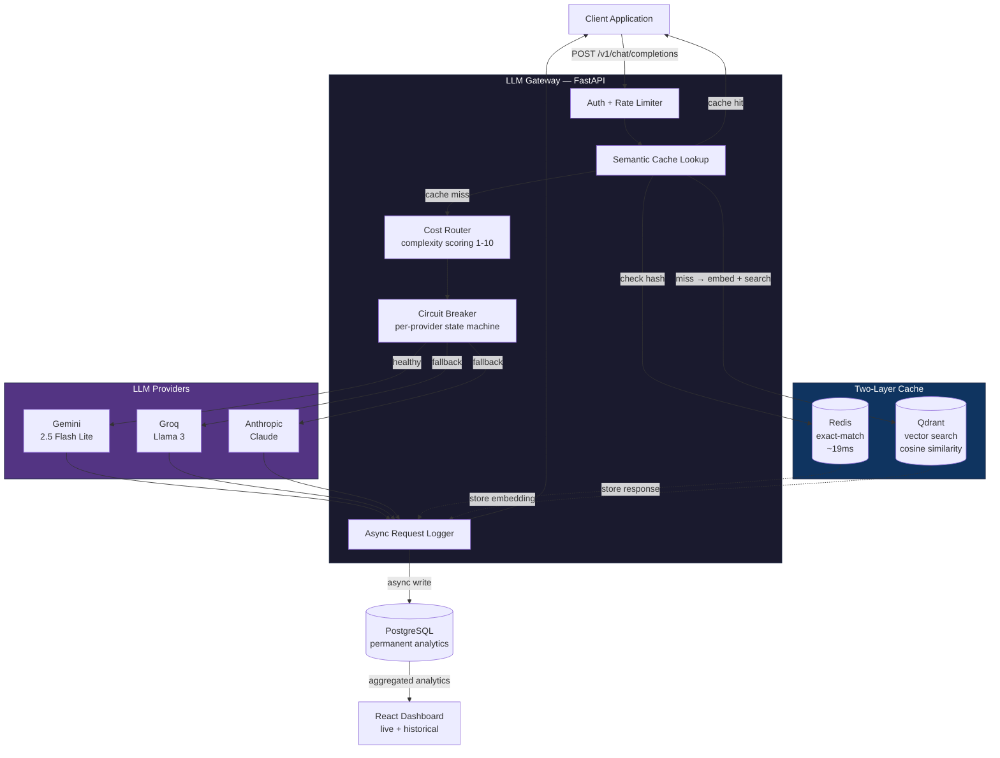
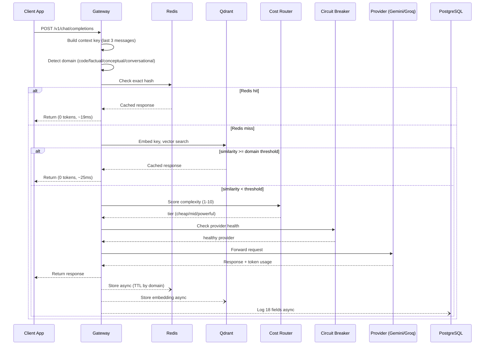
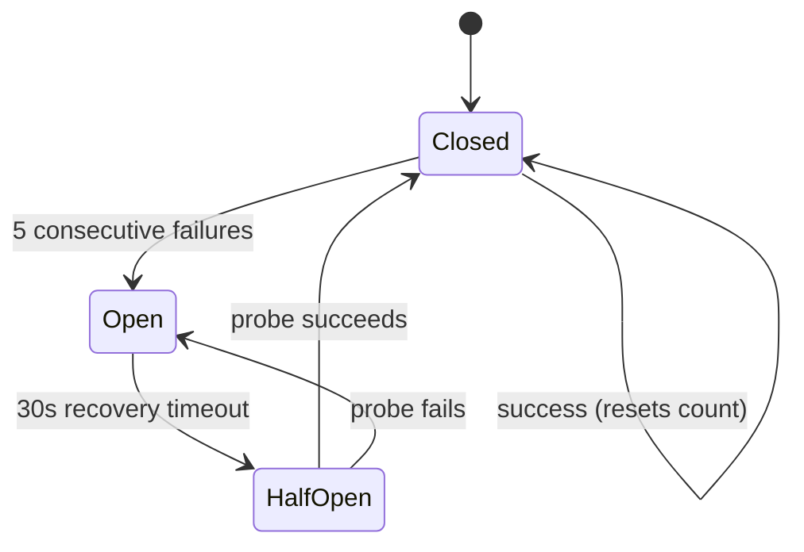

# LLM Gateway

A self-hosted middleware server that sits between any application and multiple LLM providers — making AI calls cheaper, faster, and more reliable through semantic caching, intelligent cost routing, and automatic provider failover.


**[Live Demo](#)** &nbsp;·&nbsp; **[API Docs](#)** &nbsp;·&nbsp; **[Architecture](#architecture)**

---

## The problem

Every team building on LLM APIs runs into the same three problems:

1. **Duplicate cost** — the same question gets asked hundreds of times, and every single call is billed in full. No caching exists at the infrastructure level.
2. **Overpaying for simple queries** — "what is 2+2" and "design a distributed consensus algorithm" cost the same when both are routed to the same expensive model.
3. **No resilience** — when a provider has an outage, the application goes down with it. No automatic fallback exists.

This gateway solves all three in one infrastructure layer, without requiring any change to application code. Point your app at the gateway instead of OpenAI/Gemini/Anthropic directly, and it handles the rest.

---

## Architecture



### Request lifecycle



---

## What makes this different

Most LLM gateways (LiteLLM, PortKey, Helicone) implement semantic caching with a **single message embedding** and a **fixed similarity threshold**. This project identifies and fixes two specific failure modes in that approach.

### Improvement 1 — Context-aware cache keys

**The problem:** the same question means different things in different conversations.

```
Conversation A: "I am a Python developer" → "tell me about Python"
Conversation B: "I love reptiles"         → "tell me about Python"
```

A standard cache embeds only the last message — both conversations would hit the same cache entry and get the wrong answer for one of them.

**The fix:** the cache key embeds the last 3 messages combined, not just the current one. Validated by measuring cosine similarity of **0.69** between the two contexts above — different enough to avoid a cross-context cache hit, while still recognizing the underlying topic.

```python
# gateway/cache/context_builder.py
def build_key(self, messages: list[Message]) -> str:
    recent = messages[-self.context_window:]   # last 3 messages
    parts = [f"{m.role}: {m.content[:200]}" for m in recent]
    return " | ".join(parts)
```

### Improvement 2 — Domain-adaptive similarity thresholds

**The problem:** a single fixed threshold cannot be correct for every kind of question.

```
"sort array ascending"  vs  "sort array descending"   → 0.93 cosine similarity
"what is ML"             vs  "explain ML"               → 0.78 cosine similarity
```

A fixed threshold of, say, 0.90 would correctly cache the factual pair but **incorrectly serve the wrong answer** for the code pair — two operations with opposite results scored above the threshold.

**The fix:** thresholds are tuned per domain, detected via keyword classification before the embedding step:

| Domain | Threshold | Reasoning |
|---|---|---|
| `code` | 0.96 | Precision-critical — near-identical phrasing can have opposite answers |
| `conceptual` | 0.78 | Explanations need topical relevance, some rephrasing tolerance |
| `factual` | 0.75 | Facts are stable; rephrasing should still hit |
| `conversational` | 0.70 | Casual exchanges — loosest matching is fine |

Validated at **100% threshold accuracy** across 6 controlled test pairs (see [`tests/test_hit_rate.py`](tests/test_hit_rate.py)).

---

## Core features

### Provider abstraction (Adapter pattern)
Every provider — Gemini, Groq/Llama 3, Anthropic — implements a shared `BaseProvider` interface (`complete()`, `stream()`, `is_available()`). The gateway never talks to a provider SDK directly. Adding a new provider means writing one new adapter class; nothing else in the codebase changes.

```python
class BaseProvider(ABC):
    @abstractmethod
    async def complete(self, model: str, messages: list[Message]) -> CompletionResponse: ...
    @abstractmethod
    async def stream(self, model: str, messages: list[Message]) -> AsyncGenerator[str, None]: ...
    @abstractmethod
    def is_available(self) -> bool: ...
```

### Circuit breaker (per-provider fault tolerance)
A three-state machine (`closed → open → half-open`) tracks failures independently per provider.



When a provider's circuit opens, the gateway skips it instantly (no timeout wait) and routes to the next healthy provider in the fallback chain — validated by triggering real provider failures and observing automatic recovery.

### Hybrid cost router
A two-stage complexity classifier:

- **Stage 1 — obvious filter** (instant, free): greetings → `cheap`, code blocks/architecture keywords → `powerful`. Covers roughly half of real traffic with zero computation.
- **Stage 2 — keyword scoring** (instant, free): scores 1–10 based on word count, complex/simple keyword signals, domain, and conversation depth. A structured placeholder exists for an LLM-based classifier on the ambiguous 4–6 range.

Routing a simple query to a cheap model costs **$0.000022**; the same query on GPT-4o costs **$0.002250** — a **99% reduction**.

### Async PostgreSQL analytics
Every request logs 18 fields (provider, model, domain, tier, complexity score, token counts, cost, savings, cache hit/layer, similarity score, per-stage latency, routing reasoning) via a fire-and-forget `asyncio.create_task()` — logging never adds to response latency. The `/analytics` endpoint aggregates this into per-provider, per-tier, per-model, hourly trend, and p50/p95/p99 latency breakdowns.

### Live dashboard
React + Tailwind v4 split-panel interface. Left panel is a chat UI showing provider, model, cache status, tier, complexity score, cost, and latency inline on every message. Right panel has a **Live** tab (session metrics, 2s polling) and a **Historical** tab (all-time PostgreSQL analytics).

---

## Measured results

All numbers below were captured from real test runs and logged production data — not estimates.

| Metric | Value | Source |
|---|---|---|
| Cache hit rate | 66% | session test, `/cache/stats` |
| Cache avg latency | 19ms | PostgreSQL `avg_cache_latency_ms` |
| Provider avg latency | 8,875ms | PostgreSQL `avg_provider_latency_ms` |
| Cache speedup | **466x** | computed from the two above |
| Semantic threshold accuracy | 100% (6/6) | `tests/test_hit_rate.py` |
| Simple query cost | $0.000022 | cost router, Gemini Flash Lite |
| Cost reduction vs GPT-4o | 99% | cost router savings calc |
| Test suite | 51 tests, 100% passing | `pytest tests/ -v` |
| CI/CD | GitHub Actions on every push | `.github/workflows/ci.yml` |

```
Semantic similarity validation (tests/test_hit_rate.py):

  Q1                              Domain          Sim     Threshold  Hit    Result
  -------------------------------------------------------------------------------
  what is machine learning        factual         0.7841     0.75   True    OK
  what is recursion               factual         0.9679     0.75   True    OK
  how are you                     conversational  0.7487     0.70   True    OK
  sort ascending                  code            0.9323     0.96   False   OK
  what is ML vs cook pasta        factual         0.0000     0.75   False   OK
  explain TCP vs UDP              conceptual      0.5972     0.78   False   OK

  Threshold accuracy: 6/6 = 100%
```

---

## Tech stack

| Layer | Technology | Why |
|---|---|---|
| API server | FastAPI + uvicorn | Async-native, OpenAI-compatible schema is straightforward to implement |
| Exact cache | Redis | Sub-millisecond key lookup, native TTL support |
| Vector store | Qdrant | Purpose-built for cosine similarity search |
| Embeddings | sentence-transformers (`all-MiniLM-L6-v2`), local | Zero API cost, zero quota limits, works offline, consistent forever |
| Persistent logs | PostgreSQL + asyncpg | Structured history for cost/latency analytics, survives restarts |
| LLM providers | Gemini, Groq/Llama 3 | Free tiers, OpenAI-compatible, both production-tested |
| Frontend | React + Vite + Tailwind v4 | Fast dev loop, utility-first styling, no config overhead |
| Infrastructure | Docker Compose | One command spins up all services identically everywhere |
| CI/CD | GitHub Actions | Runs full test suite on every push |
| Deployment | Railway | Managed Postgres/Redis, zero-ops deploy from GitHub |

---

## Project structure

```
llm-gateway/
├── gateway/
│   ├── cache/
│   │   ├── semantic_cache.py     # two-layer cache orchestration
│   │   ├── domain_detector.py    # keyword-based domain classification
│   │   ├── context_builder.py    # context-aware cache key construction
│   │   └── embedder.py           # local sentence-transformers wrapper
│   ├── routing/
│   │   ├── cost_router.py        # hybrid complexity router
│   │   ├── circuit_breaker.py    # three-state machine
│   │   └── circuit_breaker_registry.py
│   ├── providers/
│   │   ├── base.py               # BaseProvider adapter interface
│   │   ├── gemini.py
│   │   ├── openai_provider.py    # Groq-compatible (OpenAI schema)
│   │   ├── anthropic_provider.py
│   │   └── registry.py
│   ├── logger.py                 # async PostgreSQL request logger
│   ├── config.py                 # Pydantic Settings, typed env config
│   └── main.py                   # FastAPI app, route definitions
├── dashboard/                    # React + Tailwind v4 frontend
│   └── src/App.jsx
├── tests/
│   ├── test_cache.py             # domain detector, context builder, embedder
│   ├── test_router.py            # cost router tier decisions
│   ├── test_circuit_breaker.py   # state machine transitions
│   └── test_hit_rate.py          # end-to-end hit rate measurement
├── .github/workflows/ci.yml      # test pipeline
├── docker-compose.yml
└── README.md
```

---

## Running locally

### Prerequisites
- Python 3.13+, Node.js 18+, Docker Desktop
- Free API keys: [Gemini](https://aistudio.google.com), [Groq](https://console.groq.com)

### Setup

```bash
git clone https://github.com/YOUR_USERNAME/llm-gateway
cd llm-gateway

# Configure environment
cp .env.example .env
# add GEMINI_API_KEY and OPENAI_API_KEY (Groq) to .env

# Start infrastructure
docker compose up -d

# Backend
cd gateway
pip install -r requirements.txt
python -m uvicorn main:app --reload --port 8000

# Frontend (new terminal)
cd dashboard
npm install
npm run dev
```

Visit `http://localhost:5173` for the dashboard, `http://localhost:8000/docs` for interactive API docs.

### Running tests

```bash
pytest tests/ -v                    # all 51 tests
pytest tests/test_hit_rate.py -v -s # with similarity score output
```

---

## API reference

| Endpoint | Method | Description |
|---|---|---|
| `/v1/chat/completions` | POST | Main gateway endpoint — OpenAI-compatible |
| `/health` | GET | Service status, available providers, circuit breaker states |
| `/cache/stats` | GET | Session cache hit/miss breakdown |
| `/analytics` | GET | Full PostgreSQL-backed historical analytics |
| `/providers/health` | GET | Per-provider circuit breaker state |
| `/docs` | GET | Interactive Swagger UI |

**Example request:**

```bash
curl -X POST http://localhost:8000/v1/chat/completions \
  -H "Content-Type: application/json" \
  -d '{
    "messages": [{"role": "user", "content": "what is recursion"}],
    "preferred_provider": "gemini"
  }'
```

```json
{
  "provider_used": "gemini",
  "model": "gemini-2.5-flash-lite",
  "content": "Recursion is a programming technique...",
  "cache_hit": false,
  "routing": {
    "complexity_score": 3,
    "tier": "cheap",
    "reasoning": "factual keyword match"
  },
  "cost": { "estimated_usd": 0.000022, "savings_vs_gpt4o_usd": 0.002228 },
  "tokens": { "prompt": 6, "completion": 142 }
}
```

---

## Roadmap

- [ ] Wire Groq classifier into the ambiguous-range routing stage (structure already in place)
- [ ] Token-level streaming via Server-Sent Events
- [ ] Per-API-key authentication and rate limiting
- [ ] Multi-worker deployment with Redis-backed circuit breaker state


